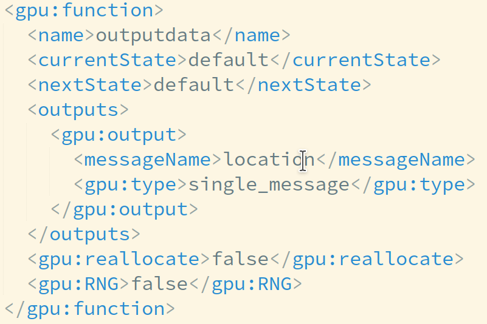
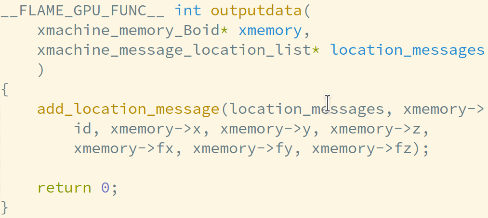
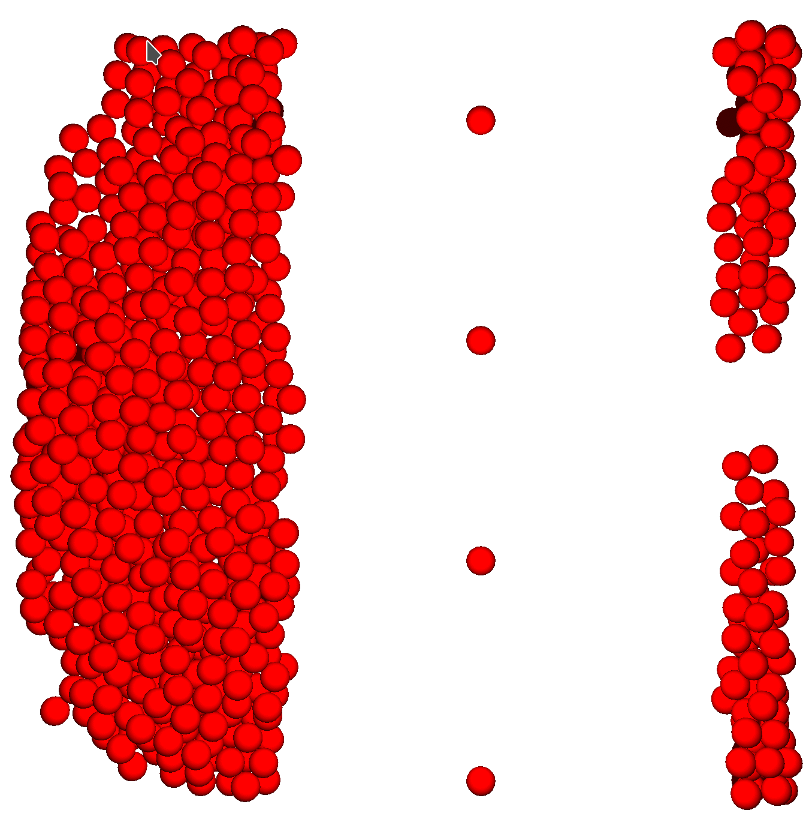
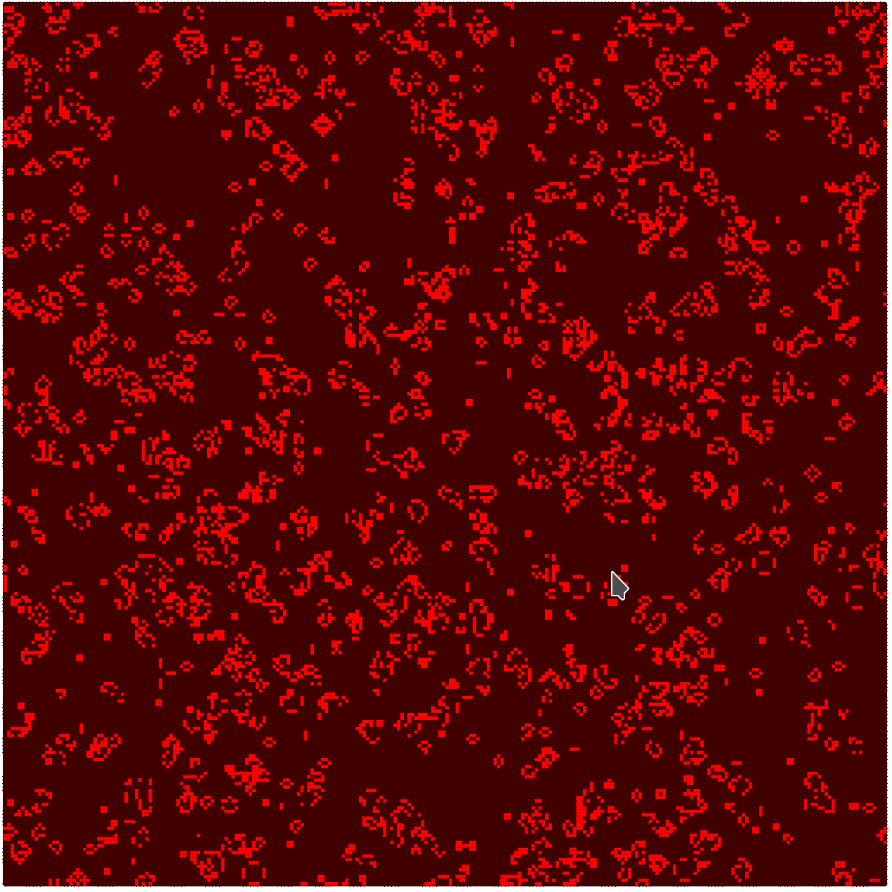
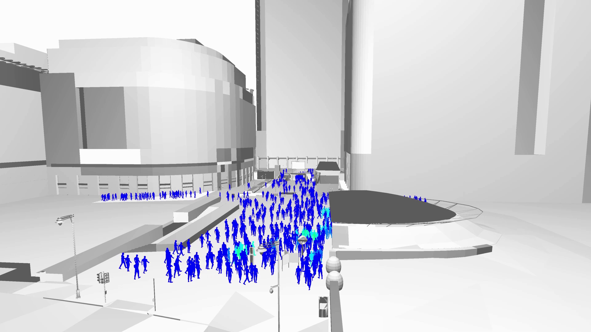
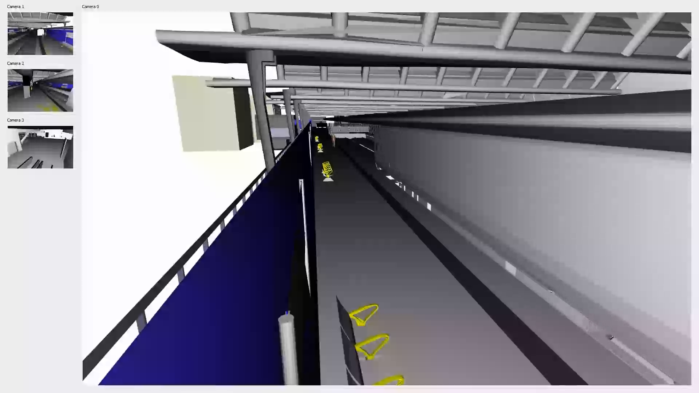

title: FLAME GPU
shorttitle: FLAME GPU
mainauthor: Peter Heywood and Mozhgan Kabiri Chimeh
institute: The University of Sheffield
class: animation-fade
layout: true

.bottom-bar[
.col-6[
{{shorttitle}}
]
.col-6[
{{mainauthor}}, {{institute}}
]
]

---

class: impact

<!-- .tr-uni-logo[

] -->

# {{title}}
## {{mainauthor}},
 
### {{institute}}

---

# FLAME GPU
.bigger[

.col-12[

**F**lexible **L**arge-Scale **A**gent **M**odelling **E**nvironment for the **GPU**
]

.col-7[

+ High performance agent-based simulator
    + GPU knowledge NOT required

+ Agents modelled using X-Machines
    + *message lists* for communication

+ Template-based simulation environment

+ Well-suited to:
    + **Large-scale Populations** 
    + **Light-weight Agents**

]
.col-5.img-col[
.center[
.w-60[

]

github.com/flamegpu/

**flamegpu.com**

]
]
]

---

# FLAME GPU Code Generation Process

.col-7.img-col[
.w-100[

]
]

.col-5.img-col[
.w-95[

]
]

---

# Examples: Keratinocyte & Game of Life

.col-6.center[

**Keratinocyte Cell Simulation**

.w-80[

]

]
.col-6.center[

**Game of Life**
.w-80[

]

]

---

# Example: Pedestrian

.col-12[
.img-col.responsive[
<video width="1920" height="1080" controls loop muted poster="video/ped-london-1080p25.png">
    <source src="video/ped-london-1080p25.webm" type="video/webm">
  Your browser does not support the video tag.
</video>

]

]

---

# Example: Road Network Simulation

.col-12.img-col.responsive[
<video width="1920" height="1080" controls loop muted poster="video/ttrig-1080p30.png">
    <source src="video/ttrig-1080p30.webm" type="video/webm">
  Your browser does not support the video tag.
</video>

]

---

# Example: Multi-Mode Simulation

.col-12.responsive[
<video width="1920" height="1080" controls loop muted poster="video/S2AM-1080.png">
    <source src="video/S2AM-1080-2.webm" type="video/webm">
  Your browser does not support the video tag.
</video>

]

---

# FLAME GPU 2
.slightly-bigger[
.col-6[
+ *Under Active Development*

+ Ground-up rewrite
+ Modern C++/CUDA
+ Improved:
    + Performance
    + Usability
    + Maintainable

]
.col-6[
+ New functionality (planned)
    + Automatic parameter exploration
    + Concurrent batch simulation
    + Multi-GPU support
    + Higher-level language bindings
        + I.e. Python

[github.com/flamegpu/flamegpu2_dev](https://github.com/flamegpu/flamegpu2_dev)

]
.col-12.center.bigger[
 
**What features do you want to see?**

]
]
